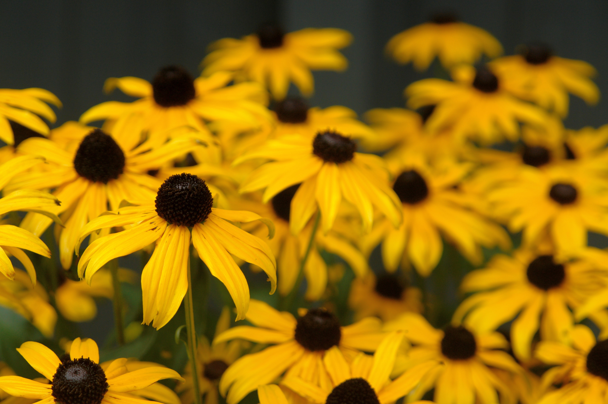
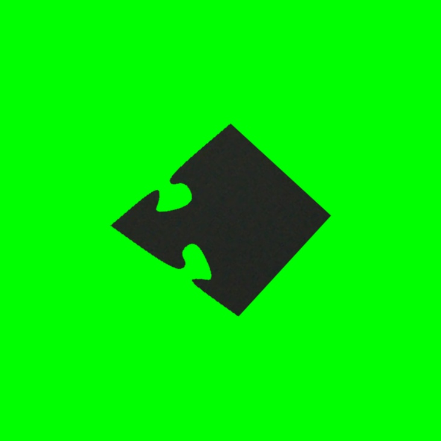
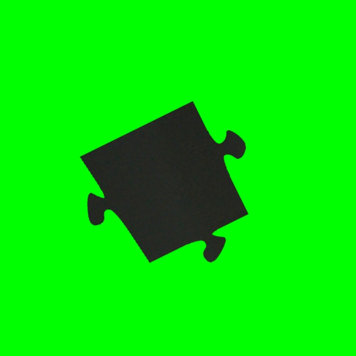
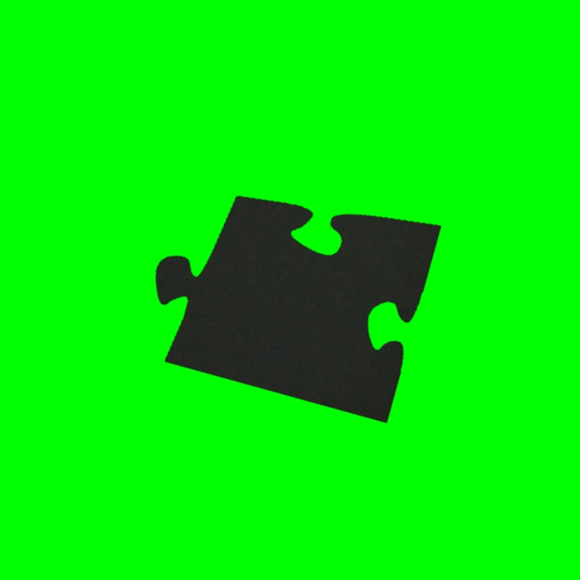
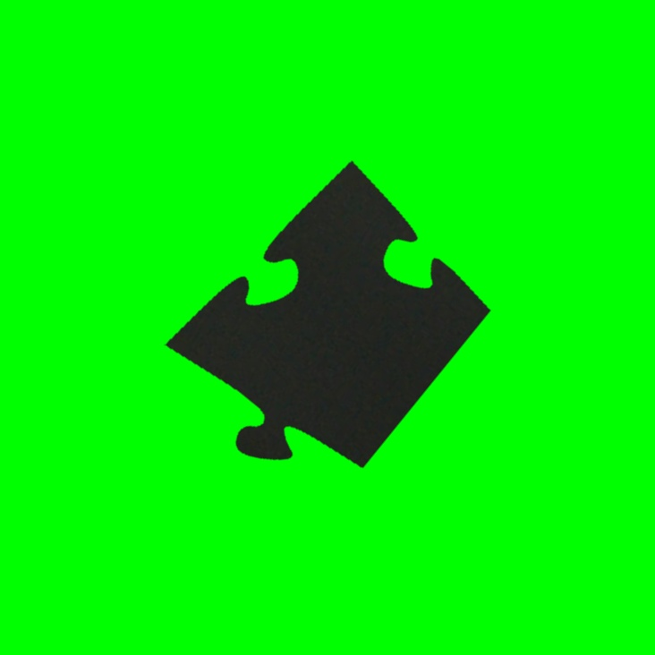
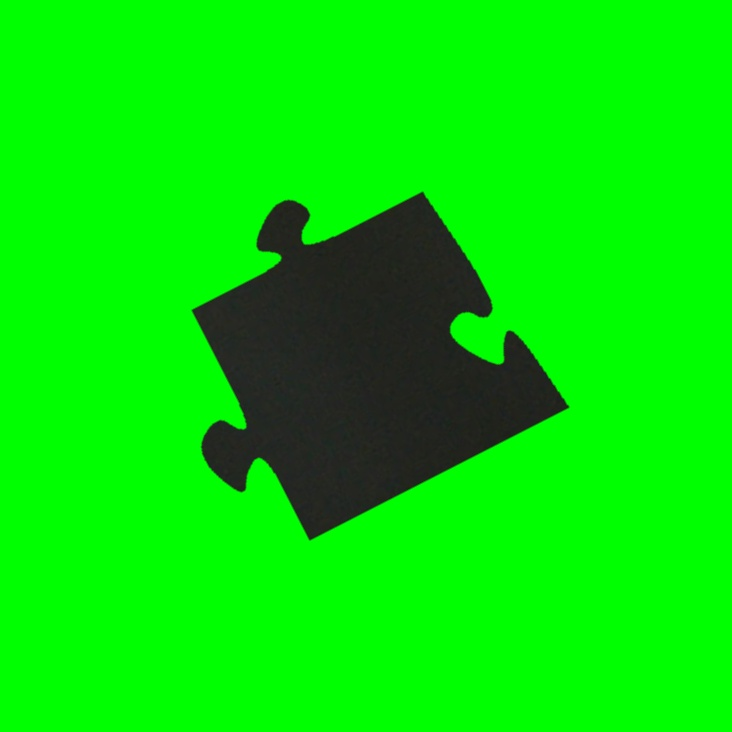
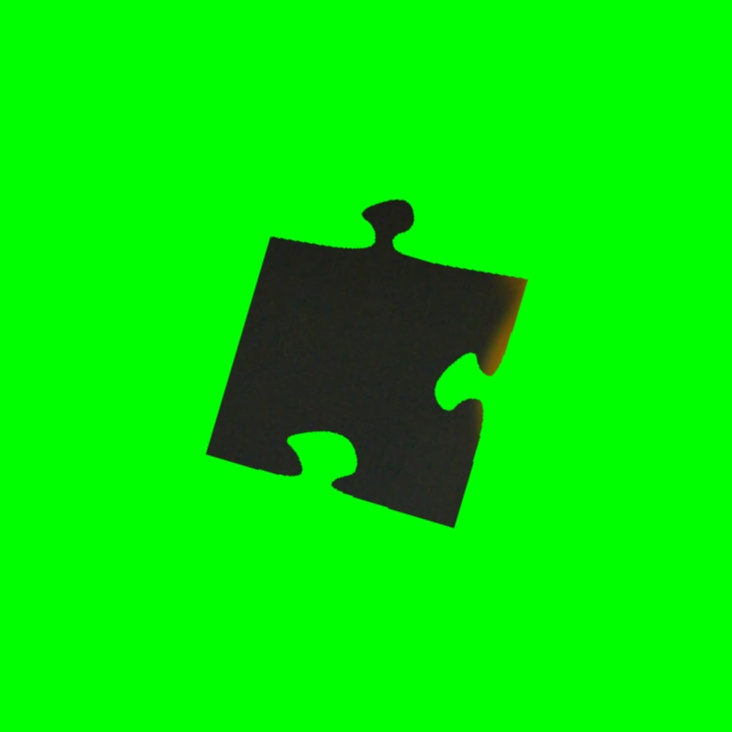
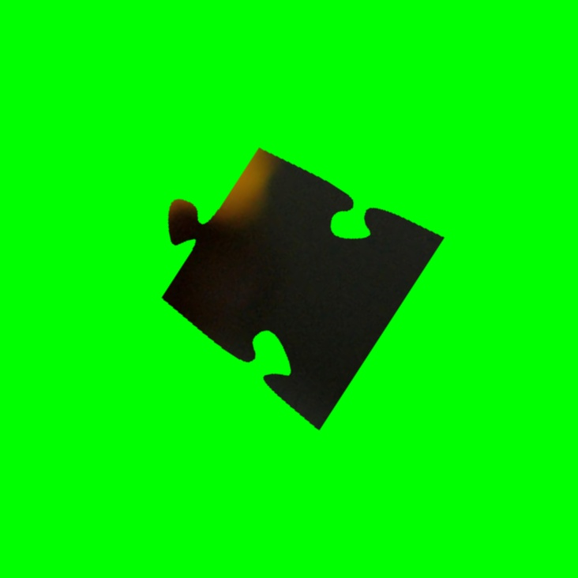
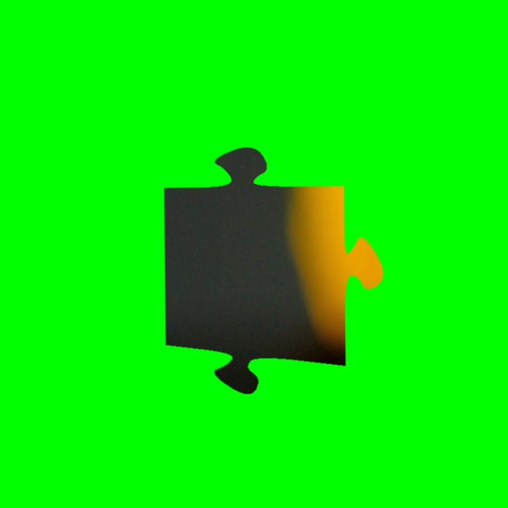
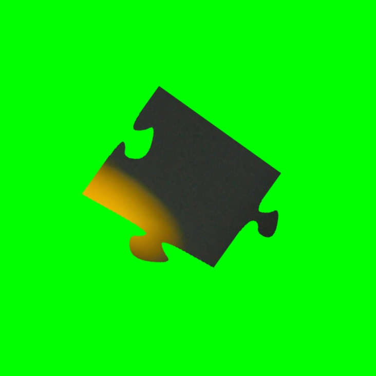

# Jigsaw-puzzle
Synthesises jigsaw puzzle pieces from a given image. Contour detection and shape analysis used to characterise each piece and to perform reconstruction of the original image by aligning compatible edges.

## Example: Yellow Flowers Puzzle

### Original Image

### Generated Puzzle Pieces (First 9 pieces)
The puzzle has been divided into 150 pieces (10x15 grid). Here are the first 9 pieces:

| p000 | p001 | p002 |
|------|------|------|
|  |  |  |

| p003 | p004 | p005 |
|------|------|------|
|  |  |  |

| p006 | p007 | p008 |
|------|------|------|
|  |  |  |
