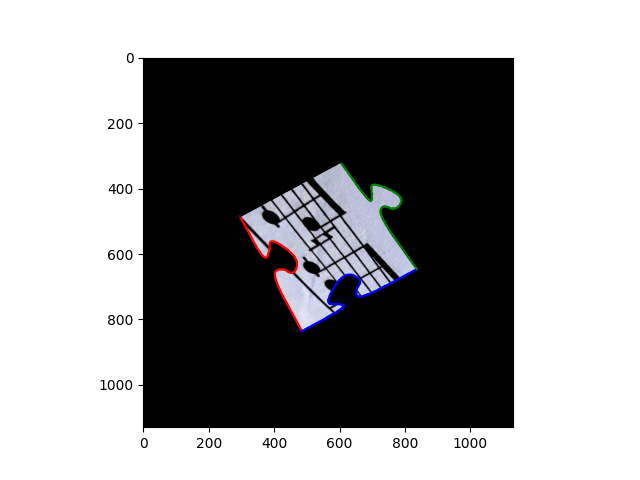
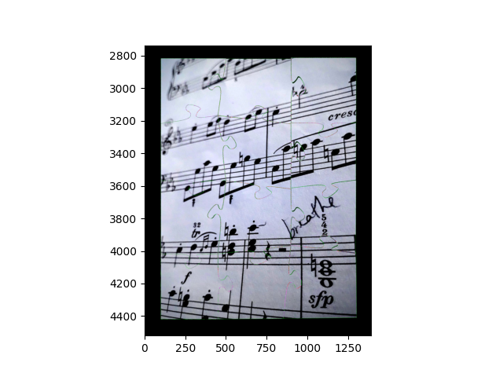

# Jigsaw-puzzle solver
Synthesises jigsaw puzzle pieces from a given image. Contour detection and shape analysis used to characterise each piece and to reconstruct the original image by aligning compatible edges.

## Sheet music

### Original image

### All pieces (green background)

### Single piece processing (left to right)

  
  
  
  

### Solved

## Comparisons

### 3x2 grid: All pieces (green) vs solved

| All pieces (green) | Solved |
|---|---|
|  |  |
|  |  |
|  |  |
