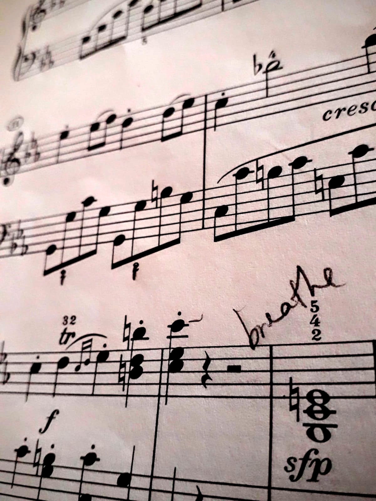
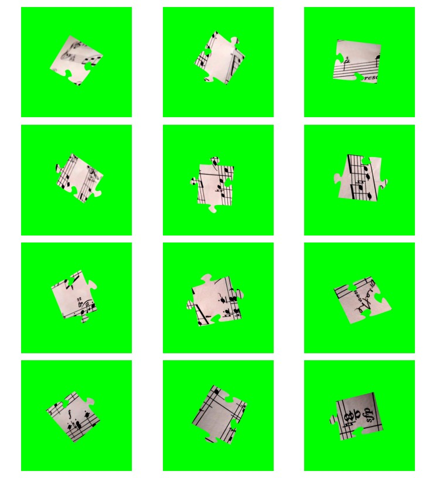
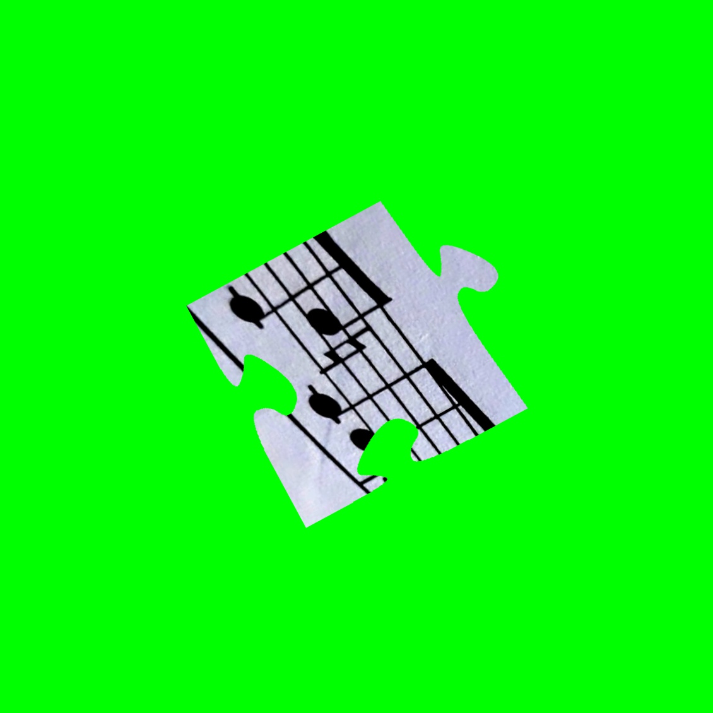
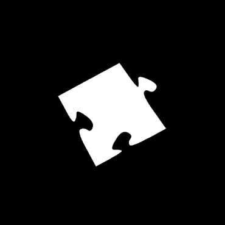
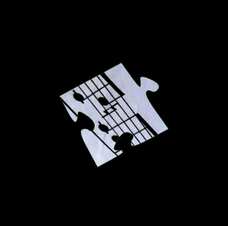
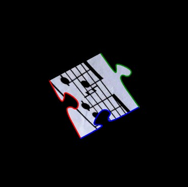
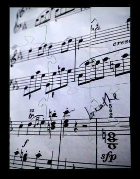
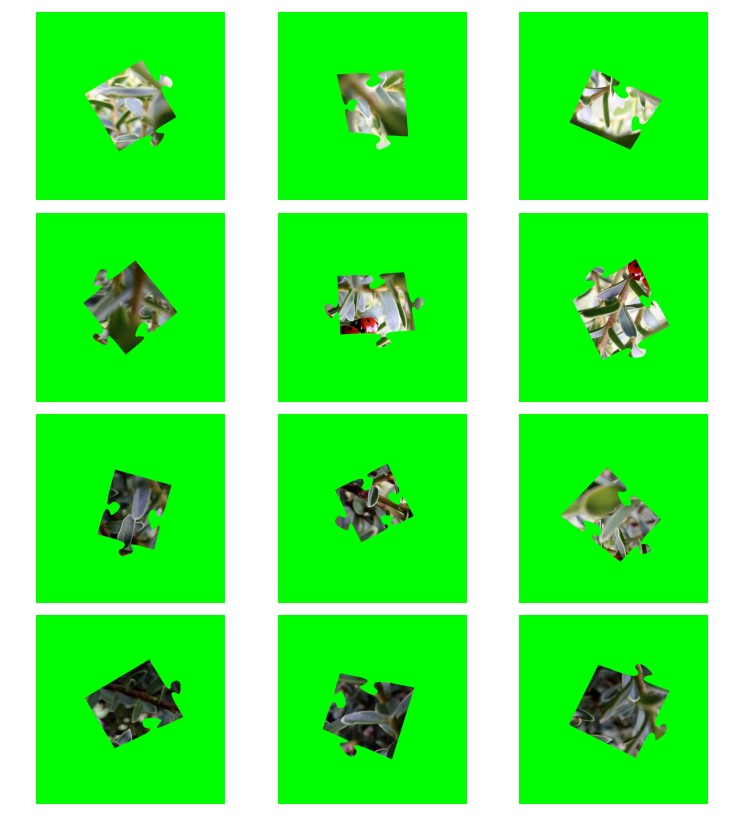
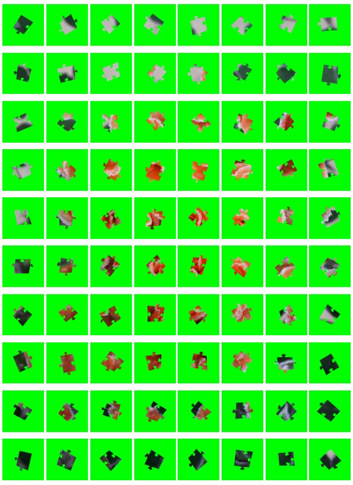
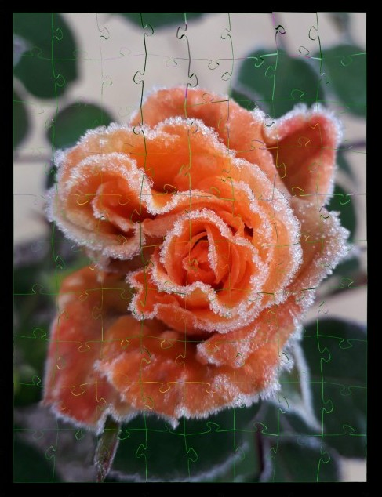

# Jigsaw-puzzle solver
Synthesises jigsaw puzzle pieces from a given image. Contour detection and shape analysis used to characterise each piece and to reconstruct the original image by aligning compatible edges.

## Sheet music

### Original image and synthesised jigsaw puzzle pieces

  
  

### Single piece processing
<table>
    <tr>
        <td></td>
        <td></td>
        <td></td>
        <td></td>
    </tr>
    <tr>
        <td align="center">Jigsaw piece</td>
        <td align="center">Piece contour</td>
        <td align="center">Background removal</td>
        <td align="center">Edge detection</td>
    </tr>
</table>

### Solved

## Examples

  
  

  
  

  
  

